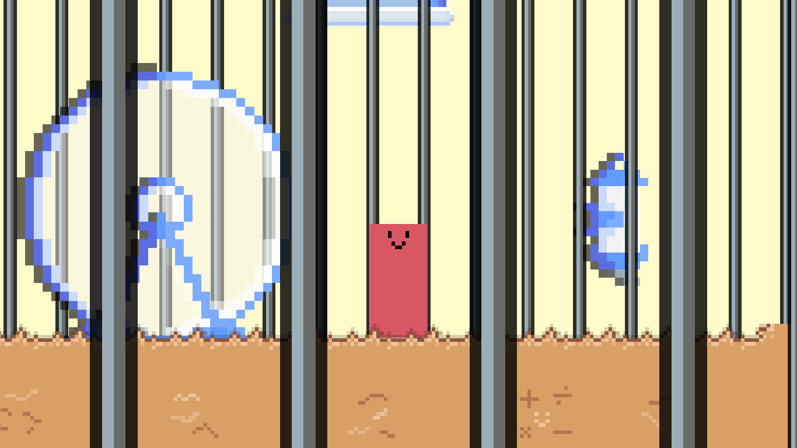

The "Project Hamster" serves as a prototype developed within my game development class. It remains incomplete and largely unplayable.

## Table of Contents:

- [Table of Contents](#table-of-contents)
- [Technical Information](#technical-information)
- [Requirements](#requirements)
- [Contributors](#contributors)

## Technical Information:

| Author          | Arthur Segato                       |
| --------------- | ----------------------------------- |
| Published       | N/A                                 |
| Status          | Prototype                           |
| Platforms       | Windows                             |
| Made with       | Unity, Aseprite, Visual Studio Code |
| License         | MIT                                 |
| Average session | N/A                                 |
| Languages       | English                             |
| Accessibility   | N/A                                 |

## Requirements

- Unity 2022.3.15f or above

## Contributors

- [@ArthurSegato](https://github.com/ArthurSegato)
